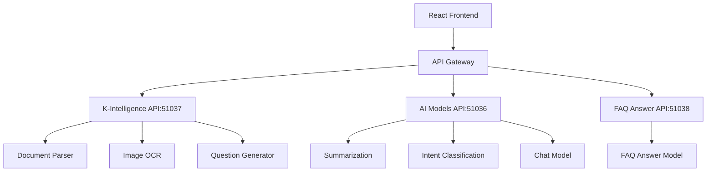

# 🚀 공고쉽 (GongoShip)
> **AI 기반 문서 분석 및 FAQ 자동 생성 플랫폼**

[](https://github.com/muniv/g)
[](https://reactjs.org/)
[](https://www.typescriptlang.org/)
[](https://github.com/muniv/g)

## 📺 시연 영상
> **🎬 곧 공개됩니다! 공고쉽의 모든 기능을 확인해보세요.**

---

## ✨ 주요 기능

### 🔍 **다양한 문서 처리**
- 📄 **PDF, HWP, Word** 문서 업로드 및 분석
- 🖼️ **이미지** 업로드 및 텍스트 추출
- 🌐 **웹 링크** 자동 크롤링 및 분석
- ✍️ **직접 텍스트** 입력 분석

### 🤖 **AI 기반 자동화**
- 📝 **FAQ 자동 생성** - 문서 내용 기반 질문 자동 생성
- 📋 **문서 요약** - 긴 문서를 핵심 내용으로 압축
- 💬 **스마트 채팅** - Intent 분류 기반 맞춤형 답변
- 🔎 **문서 검색** - 업로드된 문서 내 키워드 검색

### 🎨 **사용자 친화적 UI**
- 🌈 **직관적인 인터페이스** - 쉽고 빠른 문서 업로드
- 📱 **반응형 디자인** - 모바일/데스크톱 최적화
- ⚡ **실시간 처리 상태** - 진행률 표시 및 로딩 애니메이션
- 🎯 **원클릭 샘플** - 빠른 테스트를 위한 샘플 파일 제공

## 🏗️ 아키텍처



## 🛠️ 기술 스택

### **Frontend**
- ⚛️ **React** 18.0 - 컴포넌트 기반 UI
- 🔷 **TypeScript** - 타입 안전성 보장
- 🎨 **CSS3** - 커스텀 스타일링
- 🚦 **React Router** - SPA 라우팅
- 📡 **Fetch API** - HTTP 통신

### **AI & Backend Services**
- 🧠 **K-Intelligence API** - 문서/이미지 처리, 질문 생성
- 🤖 **AI Models API** - 요약, Intent 분류, 채팅
- 💬 **FAQ Answer API** - FAQ 답변 생성
- 🔄 **Proxy Middleware** - API 라우팅

### **Development**
- 📦 **Create React App** - 빠른 개발 환경
- 🔧 **ESLint** - 코드 품질 관리
- 🎯 **Webpack** - 모듈 번들링

## 🚀 시작하기

### 📋 **사전 요구사항**
- Node.js 16.0 이상
- npm 또는 yarn
- AI 서버들이 실행 중이어야 함

### ⚡ **빠른 설치**

```bash
# 저장소 클론
git clone https://github.com/muniv/g.git
cd g

# 의존성 설치
npm install

# 환경 변수 설정
cp .env.example .env

# 개발 서버 시작
npm start
```

### 🔧 **환경 설정**

#### **API 서버 설정**
```bash
# .env 파일 생성
REACT_APP_KINTEL_API_URL=http://20.190.194.245:51037
REACT_APP_MODELS_API_URL=http://20.190.194.245:51036
REACT_APP_FAQ_API_URL=http://20.190.194.245:51038
```

#### **프록시 설정** (`src/setupProxy.js`)
```javascript
// 자동 설정됨 - 수정 불요
// /api/kintel → localhost:51037
// /api/models → localhost:51036
// /api/models/faq_answer_model → localhost:51038
```

## 📖 사용 방법

### 1️⃣ **문서 업로드**
- 📁 **파일 업로드**: PDF, HWP, Word, 이미지 파일 드래그 앤 드롭
- 🌐 **링크 입력**: 웹사이트 URL 붙여넣기
- ✍️ **텍스트 입력**: 직접 텍스트 작성
- 🎯 **샘플 파일**: 원클릭으로 테스트 파일 사용

### 2️⃣ **AI 분석 과정**
1. 📄 **문서 파싱** - 텍스트 추출 및 청킹
2. 📝 **FAQ 생성** - AI가 자동으로 질문 생성
3. 📋 **문서 요약** - 핵심 내용 추출
4. ✅ **완료** - 결과 페이지로 이동

### 3️⃣ **결과 확인**
- 🔍 **자동 생성된 FAQ** - 문서 기반 질문과 답변
- 📝 **문서 요약** - 핵심 내용 요약
- 💬 **스마트 채팅** - 문서 내용 관련 질의응답
- 🔎 **문서 검색** - 키워드 기반 내용 검색

## 🎯 API 엔드포인트

### **문서 처리 API** (Port: 51037)
```http
POST /parse-document-from-url/    # URL 파싱
POST /parse-document/             # 문서 파싱
POST /parse-document-hwp/         # HWP 파싱  
POST /process-image/              # 이미지 처리
POST /generate-questions/         # 질문 생성
POST /search/                     # 문서 검색
```

### **AI 모델 API** (Port: 51036)
```http
POST /summarization              # 문서 요약
POST /intent                     # Intent 분류
POST /chat                       # 일반 채팅
```

### **FAQ 답변 API** (Port: 51038)
```http
POST /faq_answer_model          # FAQ 답변 생성
```

## 🔧 개발

### **개발 서버 실행**
```bash
npm start                       # localhost:3000에서 실행
npm test                        # 테스트 실행
npm run build                   # 프로덕션 빌드
```

### **코드 구조**
```
src/
├── components/                 # React 컴포넌트
│   ├── HomePage.tsx           # 메인 페이지
│   ├── DetailPage.tsx         # 결과 페이지
│   └── *.css                  # 스타일 시트
├── services/                  # API 서비스
│   └── api.ts                 # API 호출 함수들
├── types/                     # TypeScript 타입 정의
│   └── index.ts               # 인터페이스 및 타입
└── setupProxy.js             # 프록시 설정
```

## 🎨 주요 컴포넌트

### **HomePage** 
- 📁 파일 업로드 인터페이스
- 🌐 URL 입력 및 크롤링
- ✍️ 텍스트 직접 입력
- 🎯 샘플 파일 제공
- ⚡ 실시간 처리 상태 표시

### **DetailPage**
- 📝 생성된 FAQ 표시
- 📋 문서 요약 뷰어
- 💬 스마트 채팅 인터페이스
- 🔎 문서 내 검색 기능

## 🌟 특장점

### ⚡ **빠른 처리 속도**
- 병렬 API 호출로 처리 시간 단축
- 청킹 기반 효율적 문서 분석

### 🎯 **높은 정확도**
- K-Intelligence 엔진 기반 고품질 텍스트 추출
- Intent 분류를 통한 맞춤형 답변 제공

### 🔧 **확장 가능한 구조**
- 마이크로서비스 아키텍처
- 새로운 AI 모델 쉽게 추가 가능

### 🎨 **사용자 중심 설계**
- 직관적인 드래그 앤 드롭 인터페이스
- 실시간 피드백 및 진행률 표시

## 🤝 기여하기

1. Fork 프로젝트
2. Feature 브랜치 생성 (`git checkout -b feature/AmazingFeature`)
3. 변경사항 커밋 (`git commit -m 'Add some AmazingFeature'`)
4. 브랜치에 Push (`git push origin feature/AmazingFeature`)
5. Pull Request 생성

## 📄 라이선스

이 프로젝트는 MIT 라이선스 하에 배포됩니다. 자세한 내용은 `LICENSE` 파일을 참조하세요.

## 📞 문의

- 📧 **Email**: [문의 이메일]
- 🐙 **GitHub**: [https://github.com/muniv/g](https://github.com/muniv/g)
- 📝 **Issues**: [GitHub Issues](https://github.com/muniv/g/issues)

---

<div align="center">

### 🎉 **공고쉽과 함께 스마트한 문서 분석을 경험해보세요!**

[](https://github.com/muniv/g/stargazers)
[](https://github.com/muniv/g/network/members)

</div>